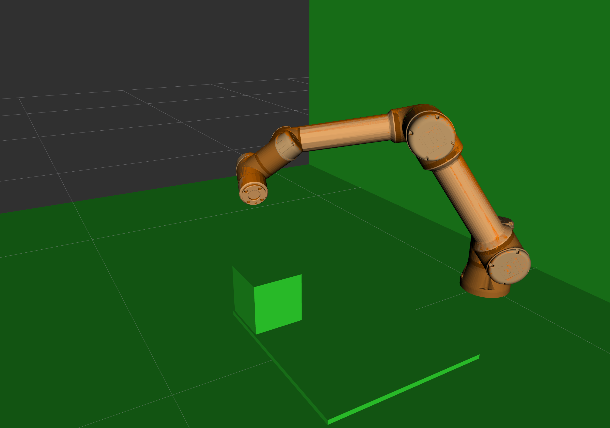

# In Hand Manipulation (IHM) Project at Imperial College London

By Athanasios Kantas, Qiyang Yan, Sean Xiao, Nick Zheng, Alexandria Perkin  
Supervisor: Dr Ad Spiers

## Table of Contents

- [Introduction](#introduction)
- [Implementation](#Implementation)
- [Gripper Control](#Gripper_Control)
- [Ethical Consequences](#Ethical_Consequences)
- [Sustainability](#Sustainability)
- [Installation](#installation)
- [Usage](#usage)
- [Contributing](#contributing)
- [License](#license)


## Introduction

Welcome to the repository for the 3rd-year consultancy project conducted in collaboration with the Imperial College London Manipulation and Touch Lab (https://www.imperial.ac.uk/manipulation-touch/). The objective of this project was to use a robot arm and a novel variable friction gripper, to perform a toy assembly task with In Hand Manipulation. This project serves as a proof of concept for a potential production line application. This documentation will provide you with a comprehensive understanding of the project and its components, enabling you to take over its development.

## Computer Vision

This part aims to develop a vision system to accurately detect and track an object's coordinates using a depth camera. The goal is to obtain the object's coordinates in the gripper's coordinate frame, which can then be used in a gripper control algorithm. The vision system uses an Intel RealSense D435i depth camera mounted on an adjustable base with an adjustable angle to capture the entire field of view of the gripper. The system processes images and applies algorithms to identify and track the object of interest.


### Hardware 


#### Hardware design history 

1. The initial un-adjustable base design didn't allow the RGB camera to be centered due to its left-sided placement on the camera.
2. The un-adjustable angle didn't include the whole gripper in the image, regardless of its position.
3. The final design incorporates an adjustable base and angle. This design allows the camera to capture the entire field of view of the gripper, keeping the gripper centered at the start position.

### Software 

#### Software design history

1. The initial approach used an ArUco marker for object detection, which proved to be accurate and robust. However, this method required different markers for different objects, which is not desirable for shape sorting.
   
2. The second approach used HSV colour space thresholding. This technique allows object identification without changing the object's characteristics. However, the HSV threshold values must be calibrated to accommodate different lighting conditions.

3. The final design is based on HSV colour space thresholding. This approach fits the goal we set in the project and it is more generalisable.
#### Detailed Implementation 

##### Image processing


Images are processed using Gaussian blur filtering before thresholding to reduce high-frequency noise. Post thresholding, morphological operations, and median blur filters are applied to further reduce noise and smooth the image's edges.

##### Coordinates calculation


OpenCV's contour detection function identifies the contours in the image. A bounding box is drawn around the largest contour, taken as the object of interest. The center of the object is calculated as the geometric center of the bounding box. The SolvePnP functions from OpenCV are used to get the coordinates of the object in 3D relative to the camera coordinate frame. The theory is shown in the figure above. The transformation matrix, measured in the CAD file, transforms the coordinates from the camera frame to the gripper frame. Specifically, the transformation is 0 on the x-axis, -28.35 on the y-axis, and 78.77 on the z-axis, with a rotation of 122.56 degrees anticlockwise around the x-axis. These values are project-specific and depend on the camera mount design.

### Performance and Recommendations

The system, using a camera with FPS30 and 1280X720 resolution, updates the object's center coordinates in each frame, providing real-time tracking. The system performs optimally in well-lit environments with uniquely colored objects. However, changes in lighting conditions can affect HSV values, necessitating occasional calibration. 


### Usage

#### Package Installation
 Before using the project, install the necessary Python packages: 
 pyrealsense2 (if using Intel RealSense camera);
 numpy;
opencv-python

#### Camera Calibration

Clone the project from https://github.com/niconielsen32/CameraCalibration.git and prepare the images containing the chessboard taken by the camera intended to use in the project. Collect the camera's intrinsic and distortion coefficients and adjust these values in the get_camera_coordinates function in the [finalvision_hsv.py](https://github.com/thanasiskantas/IHM_Robotics_Consultancy_Project/blob/00b76ba407fd9bcee9a7d44300f1b258b95658ad/Vision/finalvision_hsv.py).

#### HSV Value
Run the [findhsvvalue.py](https://github.com/thanasiskantas/IHM_Robotics_Consultancy_Project/blob/00b76ba407fd9bcee9a7d44300f1b258b95658ad/Vision/findhsvvalue.py) and drag the track bar to find a range of HSV values in  [finalvision_hsv.py](https://github.com/thanasiskantas/IHM_Robotics_Consultancy_Project/blob/00b76ba407fd9bcee9a7d44300f1b258b95658ad/Vision/finalvision_hsv.py) that can isolate the desired colour block. 


## Gripper Control

This algorithm is designed to utilise the finger to realise the in-hand manipulation for various sizes of objects, including sliding and rotation, with the goal of minimising the error. The algorithm has been tested on the following shapes: square cube, hexagon prism, octagon prism. 

[trajectory_final.m](https://github.com/thanasiskantas/IHM_Robotics_Consultancy_Project/blob/d2c591755910f07e84d46e6dd812f25e6b57b41a/Gripper%20Trajectory%20Generation/trajectory_final.m) generates the trajectory consisting of sliding and rotation based on the start pose and end pose entered by the user. Using this file you can simulate the generated trajectory. For rotations within the trajectory, only the start and end pose of the rotations are shown, without trajectory in-between. The sliding trajectory of the center of the object is shown with black arcs.

### Simulation

In addition, the folder [Gripper Simulation](https://github.com/thanasiskantas/IHM_Robotics_Consultancy_Project/tree/bfcf90439357cf4e225c7dbe434d14aee228815c/Gripper%20Simulation) produces a simulation process carried out using Simulink to observe the motion of objects within the gripper. A spatial contact force block is introduced to simulate various friction forces. This simulation aided in understanding the behavior of the system and allowed for the identification of preferred rotation start poses. 

### Sliding

Regarding sliding, an important observation is that any two points within the gripper moving range can be reached with three circular arcs. Therefore, for sliding movements, a mathematical model consisting of three linked arcs is introduced, allowing the gripper to select the combination with the shortest arc length using gradient descent, thereby minimizing the error introduced by friction switches. The motor angles required for sliding movements are provided in the equations.


### Rotation

A mathematical model for rotation is then presented, providing equations for clockwise and anticlockwise rotations. 

$$R2L_{left motor} = π - cos^{-1}(\frac{d_L^2 + (W/2)^2 - (d/2)^2}{d_L * (W/2)}) - cos^{-1}(\frac{l_1^2 + 2 * L^2 - d_R^2}{4 * l_1 * L^2}) - cos^{-1}(\frac{d_L^2 + l_1^2 - d^2}{2 * d_L * l_1}) - θ_L $$

To compensate for the small angle in the undesired rotation prep-pose, an extra angle calculation is introduced, effectively removing the introduced error. Furthermore, a control strategy is designed to extend the limited rotation range of the gripper, allowing rotations from -180 to 180.


### Control Strategy
Another problem was the change in the thickness of the finger when changing the level of friction. This was solved by introducing a transitional layer between adjacent moves to ensure smooth transitions and precise open-loop control. The corresponding functionused in integration can be found here [getTrajectory_improved.m](https://github.com/thanasiskantas/IHM_Robotics_Consultancy_Project/blob/d2c591755910f07e84d46e6dd812f25e6b57b41a/IHM%20Integrated%20Control/getTrajectory_improved.m) 

Additionally, closed-loop control is implemented, incorporating a vision subsystem that provides real-time localization and feedback coordinates. More information regarding the vision subsystem can be found in the dedicated section of the report. 


### UR5e control, integration and close loop control
The UR5e is controlled via Moveit with python. With MoveIt, you can define the robot's kinematic structure, specify the environment (including objects and obstacles), and plan collision-free paths for the robot's end effector. There are four functions to allow the arm to move to start position, pick up position, manipulate position, and place position. Pick up position is the object's coordinates on the board and original orientation that is set by the user. After picking up, the MATLAB machine will send a command to move UR5e to manipulation pose. Then the arm control code will request coordinates and the orientation detected by the camera and send it to the MATLAB side, to set as the start position for In-Hand-Manipulation(IHM). After IHM, UR5e will receive a command and request computer vision feedback to check the final pose of the object and calculate the error between the goal pose and the actual pose. The UR5e control code will add bias/offset to the place pose (including orientation error) to close the loop. 

## Prerequisites

- Linux machine with ROS, Moveit, Rviz and Universal Robot driver (https://github.com/UniversalRobots/Universal_Robots_ROS_Driver). Moveit uses python interface to build simulation environment, get end effector poses and plan/execute trajectory while Rviz allows the user to view the planned path via simulation. 
- For usage that requires remote control for the UR5E: MATLAB with ROS Toolbox
- Realsense driver... opencv_contrib version??

## How to use

### UR5e
-  Start the UR5e and open External control program

### ROS in linux machine
- Enter the ROS workspace where you installed the driver in
```
    source /opt/ros/noetic(your version)/setup.bash
    cd ~/catkin_wd（your workspace folder)
    source devel/setup.bash
```
- For Simulation only
```
  roslaunch ur5e_moveit_config demo.launch
```
- For real robot:
  1. Start ROS core and connect to the UR5e, run the code on seperate terminal. If the connection is successful, you can see the simulation robot has the same pose as the real one. 
    ```
      roslaunch ur_robot_driver ur5e_bringup.launch robot_ip:=192.168.0.100
    ```
    ```
      roslaunch ur5e_moveit_config moveit_planning_execution.launch
    ```
    ```
      roslaunch ur5e_moveit_config moveit_rviz.launch rviz_config:=$(rospack find ur5e_moveit_config)/launch/moveit.rviz
    ```

  2. Start the program on the UR5e and you will see 'connected to reverse interface' on the first terminal running roscore, this means you can now control the robot with Moveit. You can interact with the end effector on Rviz window and press ```plan and execute``` to move the robot.

### Vision and remote control:
 
Remote control is achieved via ROS topic and the Moveit python interface. A remote machine can run MATLAB with ROS toolbox to connect to the ROS machine. By running the MATLAB functions a ROS topic publisher is created as “control command” and sends commands to the ROS node. The ROS machine will create a ROS subscriber in python, listen to the commands and execute the commands with the Moveit interface. Vision feedback is achieved in the same way, but the publisher for vision is running on the ROS machine via python.
  - Run ```Computer_Vision.py``` to start corner detection and publishing the coordinates
  - Run ```Arm_control.py``` to set the simulation environment for trajectory planning, move the gripper to starting position and prepare to recieve and execute control commands and CV feedback. You will see the environment for obstacle detection is added to the Rviz simulation. 


## Materials

Selecting the right high friction material for the surface of a gripper's finger is crucial for achieving rotation. We selected several materials that could be used as the high friction material on the surface of the gripper's finger. After testing each one, we found that the material with the highest friction was Dycem as the surface of Dycem is tacky, allowing it to adhere to objects and provide a high coefficient of friction.


## Ethical Consequences

The primary ethical concern is ensuring the safety of humans that come into contact with the gripper and robotic arm. The UR5e robotic arm, that the gripper is attached to, is equipped with built-in force torque sensors that allow it to detect and respond to unexpected contact or collisions. When the robot comes into contact with an object or a person, it can quickly sense the force and halt its movements to prevent harm.

The introduction of robotic systems, including gripper technology, has the potential to automate certain tasks traditionally performed by humans. This can lead to job displacement, as some roles may no longer require human labour. The variable friction gripper is compact and able to perform manipulation of objects in confined spaces, unlike more traditional methods. This may lead to the replacement of workers previously used to do these tasks, for example, item pickers in a warehouse.

The gripper is equipped with a realsense camera which is used only to determine the location of the object being manipulated. No data from the camera is stored and so there are no privacy concerns.


## Sustainability

Dycem loses its stickiness over time however washing it and removing any debris sticking to the surface will restore it. Over longer periods of time the dycem gripper pads may need to be replaced to maintain the high coefficient of friction provided by the material. The gripper is designed so the gripper pads can easily be unscrewed and replaced with new ones, without needing to replace any other part of the gripper, reducing waste.

The variable friction gripper reduces the movement of the robot arm when performing manipulation, minimizing energy consumption, which translates to reduced environmental impact.

